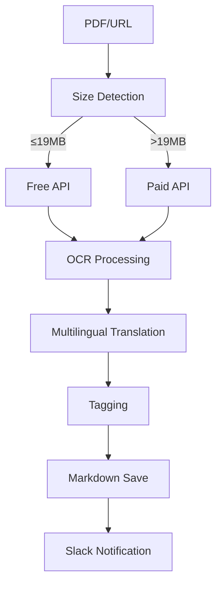

# Obsidian PDF OCR & Clipper

An AI-powered PDF OCR processing system that converts web PDFs and local PDF files to high-quality Markdown and integrates them into your Obsidian vault.

**🌏 [日本語ドキュメント](README_ja.md) | [English Documentation](README.md)**

## Background

- Since Obsidian's web clipper cannot perform OCR processing of PDFs, we built our own system to convert PDFs to Markdown. Utilizing the Gemini API with automatic switching between free and paid APIs for efficient document management.

## 🎯 System Overview

### 🌟 Key Features

- 📄 **PDF OCR Processing**: High-precision Markdown conversion of web/local PDFs
- 🌐 **Automatic Multilingual Translation**: Automated Japanese translation of English documents
- 💰 **FREE/PAID API Auto-switching**: Leverages Gemini API's free tier (as of Aug 19, 2025) with automatic fallback to paid API for large files (>19MB)
- 📱 **Slack Integration**: Real-time processing status notifications
- 📊 **Cost Tracking**: Automatic calculation and Slack notification of token usage and costs
- 🎨 **CSL Compliance**: YAML frontmatter compatible with academic literature management
- 💡 **Raycast Integration**: Simply copy a URL and type `clipPDF` in Raycast to convert PDFs to Markdown and save to Obsidian

### 🔄 Workflow



## 🏗️ System Architecture

### 📁 Directory Structure

```
obsidian-vault/
├── .env                      # Environment settings (git-ignored)
├── .env.sample              # Configuration template
├── README.md                # This file
├── README_ja.md             # Japanese documentation
├── script/                  # Execution scripts
│   ├── clipPDF.sh          # Web PDF processing (Raycast frontend)
│   ├── background_ocrPDF.sh # Main OCR processing engine
│   ├── background_slack.sh  # Slack notification module
│   ├── tag.md              # Tag dictionary (optional)
│   └── temp_*/             # Temporary processing directories
├── vault/                   # Obsidian content (configurable)
│   ├── clip/               # Web PDF output
│   ├── scan/               # Local PDF output
│   └── paper/              # Academic literature output
└── attachments/             # Original PDF file storage
```

## 🛠️ Setup

### 1. System Requirements

```bash
# macOS essential tools
brew install poppler jq optipng

# System commands (usually pre-installed)
# curl, base64, bc (basic calculations)
```

### 2. Environment Configuration

```bash
# Create configuration file
cp .env.sample .env

# Edit required settings
vim .env
```

#### Required Configuration Items

| Setting           | Description                    | Source                                                       |
| ----------------- | ------------------------------ | ------------------------------------------------------------ |
| `AI_API_KEY`      | Gemini API (basic)             | [Google AI Studio](https://makersuite.google.com/app/apikey) |
| `AI_API_KEY_PAID` | Gemini Paid API (for >19MB)    | [Google Cloud Console](https://console.cloud.google.com/)    |
| `SLACK_BOT_TOKEN` | Slack notifications (optional) | [Slack API](https://api.slack.com/apps)                      |

### 3. Pricing Configuration (Important)

```bash
# Gemini API pricing (2025 rates)
GEMINI_INPUT_COST_PER_1K=0.0025      # $0.0025/1000 tokens
GEMINI_OUTPUT_COST_PER_1K=0.015      # $0.015/1000 tokens
GEMINI_THOUGHTS_COST_PER_1K=0.0025   # $0.0025/1000 tokens
```

## 🚀 Usage

### 📄 PDF OCR Processing

#### 🌐 Web PDFs

```bash
./script/clipPDF.sh "https://example.com/paper.pdf"
./script/clipPDF.sh "https://example.com/paper.pdf" paper
```

#### 📱 Local PDFs

```bash
./script/clipPDF.sh "/path/to/document.pdf"
./script/clipPDF.sh "/path/to/document.pdf" scan
```

#### 🎯 Processing Categories

- **clip**: PDFs from web (default)
- **scan**: Scanned local PDFs
- **paper**: Academic papers

### 💰 FREE/PAID API Auto-switching

The system automatically selects the optimal API:

- **≤19MB**: FREE API usage (cost reduction)
- **>19MB**: PAID API usage (high-speed processing)
- **Auto fallback**: Only processes ≤19MB files when PAID API key is not configured

### 🌐 Multilingual Translation

Automatically adds Japanese translation for English documents:

```markdown
# Output Example

## Original Content (English)

Original English content...

## 日本語訳

Automatically translated Japanese content...
```

### 🏷️ Hybrid Tagging System

#### Automatic Tag Assignment

1. **Required tags**: Processing category (clip/scan/paper), pdf
2. **Standard tags**: 3-5 tags selected from script/tag.md
3. **Dynamic tags**: 2-4 newly created tags specific to document content

#### Dynamic Tag Examples

```yaml
tags:
  - paper
  - pdf
  - artificial_intelligence # Standard tag
  - machine_learning # Standard tag
  - transformer_architecture # Dynamic tag
  - attention_mechanism # Dynamic tag
```

### 📱 Slack Integration

#### Processing Notifications

1. **Start Notification**

```text
@user 🚀 PDF OCR Processing - Started
• URL: https://example.com/paper.pdf
```

2. **Completion Notification**

```text
@user ✅ PDF OCR Processing - Success
• PDF: research_paper.pdf
• md: paper/20250819_research_paper.md
• API: 🆓 Free API / REALTIME mode
• cost: $0.045(i$0.012+t$0.000+o$0.033: total 3,245 tkn)
• time: 2min 30sec
```

3. **Failure Notification**

```text
@user ❌ PDF OCR Processing - Failed
• PDF: large_document.pdf
• message: Large payload requires Paid API key
• API: ❓ Unknown mode
• time: 30sec
```

## 📊 Detailed Feature Requirements

### 🔍 OCR Processing Features

#### Processing Modes

| Mode         | Features          | Processing Time | Cost | Use Case                 |
| ------------ | ----------------- | --------------- | ---- | ------------------------ |
| **REALTIME** | Immediate results | 30sec-5min      | High | Urgent docs, small files |
| **BATCH**    | Queue processing  | Few mins-1hr    | Low  | Large documents          |

#### Quality Settings

- **DPI**: Dynamic adjustment (200-300, optimized by page count)
- **Optimization**: Automatic PNG compression (optipng)
- **Language**: Multilingual support (auto-detection & translation)
- **Structure Preservation**: Faithful reproduction of headings, tables, lists
- **CSL Compliance**: Academic literature metadata support

### 💰 Cost Management

#### Automatic Cost Calculation

```bash
# Auto-calculation example on completion
cost: $2.45(i$1.20+t$0.00+o$1.25: total 163,245 tkn)
```

#### Pricing Structure (Gemini 2.5 Pro)

- **Input**: $0.0025/1000 tokens
- **Output**: $0.015/1000 tokens
- **Thoughts**: $0.0025/1000 tokens

#### Cost Optimization Features

1. **Size-based API switching**: Automatic switching at 19MB threshold
2. **PNG optimization**: File size reduction via optipng
3. **Dynamic DPI adjustment**: Quality optimization based on page count
4. **Real-time calculation**: Accurate cost display upon completion

## 🔧 Advanced Configuration

### Directory Structure Customization

```bash
# .env configuration example
CONTENT_BASE_DIR=vault           # Content base directory
CLIP_OUTPUT_DIR=clip            # Web PDF output destination
PAPER_OUTPUT_DIR=paper          # Academic paper output destination
ATTACHMENTS_DIR=attachments     # PDF storage location
```

### Slack Notification Customization

```bash
# Disable notifications
SLACK_PROJECT_NOTIFICATIONS=false

# Channel settings
SLACK_REPORT_CHANNEL=""  # Notification destination channel
SLACK_MENTION_USER_ID=""  # Mention target
```

### OCR Processing Customization

```bash
# AI settings
AI_PROVIDER=gemini             # AI provider (gemini/claude/openai)
AI_MODEL=gemini-2.5-pro        # Model to use
TEMPERATURE=0.1                # AI creativity (low=accurate)

# Processing settings
PDF_TEMP_BASE_DIR=./           # Temporary file storage location
```

## 🚨 Troubleshooting

### Common Issues

#### 1. OCR Processing Errors

```bash
# Check dependencies
brew list | grep -E "(poppler|jq)"
command -v pdftoppm pdfinfo

# Check logs
ls script/failed_logs/  # Failed log storage location
```

#### 2. No Slack Notifications

```bash
# Check configuration
cat .env | grep SLACK

# Test notification
curl -X POST -H "Authorization: Bearer $SLACK_BOT_TOKEN" \
  -H "Content-type: application/json" \
  --data '{"channel":"#general","text":"test"}' \
  https://slack.com/api/chat.postMessage
```

#### 3. API Limit Errors

```bash
# For large file processing
# PAID API key required (>19MB)
AI_API_KEY_PAID=your-paid-api-key

# Check API usage
# Monitor usage in Google Cloud Console
```

#### 4. Temporary File Residue

```bash
# Manual temporary file cleanup
rm -rf script/temp_*

# Remove processing state files
rm -rf script/state/
```

## 📈 Performance

### Processing Capacity

- **PDF Processing**: Average 1-5 min/file (depends on size & page count)
- **API Response**: REALTIME 30sec-5min, BATCH few mins-1hr
- **Translation Processing**: Auto-detection & translation (no additional time)

## 💡 Use Cases

### 📚 Academic Research Workflow

```bash
# Process research papers from URLs
./script/clipPDF.sh "https://arxiv.org/pdf/2024.12345v1.pdf" paper

# Process local research papers
./script/background_ocrPDF.sh "/path/to/research_papers/" paper

# Result: vault/paper/20250819_research_title.md
# CSL-compliant metadata + auto-translation + specialized tagging
```

### 📋 Business Document Management

```bash
# Process scanned documents
./script/clipPDF.sh "/path/to/scanned/contracts.pdf" scan

# Process web PDFs
./script/clipPDF.sh "https://company.com/annual_report.pdf" clip

# Result: Auto-classification + Slack notifications + cost tracking
```

### 📱 Daily PDF Processing

```bash
# One-click execution from Raycast
# URL input → Auto-processing → Obsidian save → Slack notification

# Markdown output features:
# - CSL-compliant metadata
# - Multilingual translation
# - Hybrid tagging
# - PDF links (relative & absolute paths)
```

## 🌟 The Power of Raycast Integration

Combining with Raycast makes PDF processing remarkably simple:

### ✨ One-Click Processing

1. **Copy PDF URL** - Copy research paper or document PDF link from browser
2. **Launch Raycast** - Open Raycast with `Cmd + Space`
3. **Execute clipPDF** - Type `clipPDF` and paste URL
4. **Auto-completion** - Background processing completes, confirmed via Slack notification

### 🎯 Efficient Workflow

```text
Discover Paper → Copy URL → Raycast → clipPDF → Completion Notification
     ↓
Immediately searchable & referenceable high-quality Markdown in Obsidian
```

### 💡 Use Scenarios

- **Research**: Instant Markdown conversion upon discovering ArXiv papers
- **Business**: Immediate Obsidian integration of internal documents and reports
- **Learning**: Systematic management of technical documents and manuals

---

**🌏 [日本語ドキュメント](README_ja.md) | [English Documentation](README.md)**
