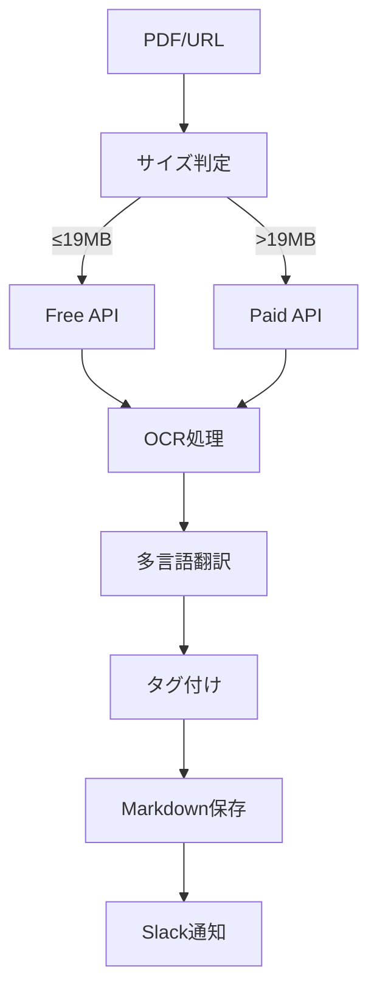

# Obsidian PDF OCR & Clipper

## 背景

- obsidian の web clipper では PDF の OCR 処理ができないため、独自に PDF を Markdown 化するシステムを構築しました。Gemini API を利用し、無料と有料の API を自動で切り替え、効率的な文書管理を実現します。

## 🎯 システム概要

### 🌟 主要機能

- 📄 **PDF OCR 処理**: Web/ローカル PDF を高精度で Markdown 化
- 🌐 **多言語自動翻訳**: 英語文書の日本語翻訳を自動化
- 💰 **FREE/PAID API 自動切替**: 現時点（2025/8/19）で一定程度まで無料で利用できる gemini の API を活用。しかしファイルサイズが大きくなると処理できない制約があるので、一定サイズ以上の場合は有料 API にて対応
- 📱 **Slack 統合**: 処理状況をリアルタイム通知
- 📊 **コスト追跡**: トークン使用量とコストを簡易計算し slack に通知
- 🎨 **CSL 準拠**: 学術文献管理に対応した YAML フロントマター
- 💡 **Raycast 統合**: URL をコピーして Raycast で `clipPDF` と入力するだけで、PDF を Markdown 化して Obsidian に保存

### 🔄 ワークフロー



## 🏗️ システム構成

### 📁 ディレクトリ構造

```
obsidian-vault/
├── .env                      # 環境設定（git-ignored）
├── .env.sample              # 設定テンプレート
├── README.md                # このファイル
├── script/                  # 実行スクリプト集
│   ├── clipPDF.sh          # Web PDF処理（Raycastフロントエンド）
│   ├── background_ocrPDF.sh # メインOCR処理エンジン
│   ├── background_slack.sh  # Slack通知モジュール
│   ├── tag.md              # タグ辞書（オプション）
│   └── temp_*/             # 一時処理ディレクトリ
├── vault/                   # Obsidianコンテンツ（設定可能）
│   ├── clip/               # Web PDFからの出力
│   ├── scan/               # ローカルPDFからの出力
│   └── paper/              # 学術文献からの出力
└── attachments/             # 元PDFファイル保存
```

## 🛠️ セットアップ

### 1. システム要件

```bash
# macOS必須ツール
brew install poppler jq optipng

# システムコマンド（通常pre-installed）
# curl, base64, bc (基本計算)
```

### 2. 環境設定

```bash
# 設定ファイルの作成
cp .env.sample .env

# 必須設定項目を編集
vim .env
```

#### 必須設定項目

| 設定項目          | 説明                           | 取得先                                                       |
| ----------------- | ------------------------------ | ------------------------------------------------------------ |
| `AI_API_KEY`      | Gemini API（基本）             | [Google AI Studio](https://makersuite.google.com/app/apikey) |
| `AI_API_KEY_PAID` | Gemini Paid API（19MB 超え用） | [Google Cloud Console](https://console.cloud.google.com/)    |
| `SLACK_BOT_TOKEN` | Slack 通知用（オプション）     | [Slack API](https://api.slack.com/apps)                      |

### 3. 価格設定（重要）

```bash
# Gemini API価格設定（2025年料金）
GEMINI_INPUT_COST_PER_1K=0.0025      # $0.0025/1000トークン
GEMINI_OUTPUT_COST_PER_1K=0.015      # $0.015/1000トークン
GEMINI_THOUGHTS_COST_PER_1K=0.0025   # $0.0025/1000トークン
```

## 🚀 使用方法

### 📄 PDF OCR 処理

#### 🌐 Web PDF

```bash
./script/clipPDF.sh "https://example.com/paper.pdf"
./script/clipPDF.sh "https://example.com/paper.pdf" paper
```

#### 📱 ローカル PDF

```bash
./script/clipPDF.sh  "/path/to/document.pdf"
./script/clipPDF.sh  "/path/to/document.pdf" scan
```

#### 🎯 処理カテゴリ

- **clip**: Web からの PDF（デフォルト）
- **scan**: スキャンしたローカル PDF
- **paper**: 学術論文

### 💰 FREE/PAID API 自動切替

システムが自動で最適な API を選択：

- **≤19MB**: FREE API 使用（コスト削減）
- **>19MB**: PAID API 使用（高速処理）
- **自動フォールバック**: PAID API キー未設定時は 19MB 以下のみ処理

### 🌐 多言語翻訳

英語文書は自動で日本語翻訳を追加：

```markdown
# 出力例

## Original Content (English)

Original English content...

## 日本語訳

自動翻訳された日本語内容...
```

### 🏷️ ハイブリッドタグシステム

#### 自動タグ付与

1. **必須タグ**: 処理カテゴリ（clip/scan/paper）、pdf
2. **標準タグ**: script/tag.md から 3-5 個選択
3. **動的タグ**: 文書内容に特化した 2-4 個新規作成

#### 動的タグ例

```yaml
tags:
  - paper
  - pdf
  - artificial_intelligence # 標準タグ
  - machine_learning # 標準タグ
  - transformer_architecture # 動的タグ
  - attention_mechanism # 動的タグ
```

### 📱 Slack 統合

#### 処理通知

1. **開始通知**

```
@user 🚀 PDF OCR処理 - 開始
• URL: https://example.com/paper.pdf
```

2. **完了通知**

```
@user ✅ PDF OCR処理 - 成功
• PDF: research_paper.pdf
• md: paper/20250819_research_paper.md
• API: 🆓 Free API / REALTIME mode
• cost: $0.045(i$0.012+t$0.000+o$0.033: total 3,245 tkn)
• time: 2分30秒
```

3. **失敗通知**

```
@user ❌ PDF OCR処理 - 失敗
• PDF: large_document.pdf
• message: Large payload requires Paid API key
• API: ❓ Unknown mode
• time: 30秒
```

## 📊 機能要件詳細

### 🔍 OCR 処理機能

#### 処理モード

| モード       | 特徴           | 処理時間    | コスト | 用途               |
| ------------ | -------------- | ----------- | ------ | ------------------ |
| **REALTIME** | 即座に結果取得 | 30 秒-5 分  | 高     | 緊急文書・小サイズ |
| **BATCH**    | キュー処理     | 数分-1 時間 | 低     | 大容量文書         |

#### 品質設定

- **DPI**: 動的調整（200-300、ページ数に応じて最適化）
- **最適化**: PNG ファイル自動圧縮（optipng）
- **言語**: 多言語対応（自動検出・翻訳）
- **構造保持**: 見出し、表、リストを忠実に再現
- **CSL 準拠**: 学術文献メタデータ対応

### 💰 コスト管理

#### 自動コスト計算

```bash
# 処理完了時の自動計算例
cost: $2.45(i$1.20+t$0.00+o$1.25: total 163,245 tkn)
```

#### 料金体系（Gemini 2.5 Pro）

- **入力**: $0.0025/1000 トークン
- **出力**: $0.015/1000 トークン
- **思考**: $0.0025/1000 トークン

#### コスト最適化機能

1. **サイズ別 API 切替**: 19MB 閾値で自動切替
2. **PNG 最適化**: optipng によるファイルサイズ削減
3. **DPI 動的調整**: ページ数に応じた品質最適化
4. **リアルタイム計算**: 処理完了時に正確なコスト表示

## 🔧 高度な設定

### ディレクトリ構造カスタマイズ

```bash
# .env設定例
CONTENT_BASE_DIR=vault           # コンテンツベースディレクトリ
CLIP_OUTPUT_DIR=clip            # WebPDF出力先
PAPER_OUTPUT_DIR=paper          # 学術論文出力先
ATTACHMENTS_DIR=attachments     # PDF保存先
```

### Slack 通知カスタマイズ

```bash
# 通知無効化
SLACK_PROJECT_NOTIFICATIONS=false

# チャンネル設定
SLACK_REPORT_CHANNEL=""  # 通知先チャンネル
SLACK_MENTION_USER_ID=""  # メンション対象
```

### OCR 処理カスタマイズ

```bash
# AI設定
AI_PROVIDER=gemini             # AIプロバイダー（gemini/claude/openai）
AI_MODEL=gemini-2.5-pro        # 使用モデル
TEMPERATURE=0.1                # AI創造性（低=正確）

# 処理設定
PDF_TEMP_BASE_DIR=./           # 一時ファイル保存先
```

## 🚨 トラブルシューティング

### よくある問題

#### 1. OCR 処理エラー

```bash
# 依存関係確認
brew list | grep -E "(poppler|jq)"
command -v pdftoppm pdfinfo

# ログ確認
ls script/failed_logs/  # 失敗時のログ保存場所
```

#### 2. Slack 通知が来ない

```bash
# 設定確認
cat .env | grep SLACK

# テスト通知
curl -X POST -H "Authorization: Bearer $SLACK_BOT_TOKEN" \
  -H "Content-type: application/json" \
  --data '{"channel":"#general","text":"test"}' \
  https://slack.com/api/chat.postMessage
```

#### 3. API 制限エラー

```bash
# 大容量ファイル処理時
# PAID APIキーが必要（19MB超過時）
AI_API_KEY_PAID=your-paid-api-key

# API使用量確認
# Google Cloud Consoleで使用状況を確認
```

#### 4. 一時ファイルの残留

```bash
# 一時ファイル手動削除
rm -rf script/temp_*

# 処理状態ファイル削除
rm -rf script/state/
```

## 📈 パフォーマンス

### 処理能力

- **PDF 処理**: 平均 1-5 分/ファイル（サイズ・ページ数による）
- **API 応答**: REALTIME 30 秒-5 分、BATCH 数分-1 時間
- **翻訳処理**: 自動判定・翻訳（追加時間なし）

## 💡 使用例・ユースケース

### 📚 学術研究ワークフロー

```bash
# 論文URL処理
./script/clipPDF.sh "https://arxiv.org/pdf/2024.12345v1.pdf" paper

# ローカル論文処理
./script/background_ocrPDF.sh "/path/to/research_papers/" paper

# 結果: vault/paper/20250819_research_title.md
# CSL準拠メタデータ + 自動翻訳 + 専門タグ付け
```

### 📋 ビジネス文書管理

```bash
# スキャン文書処理
./script/clipPDF.sh "/path/to/scanned/contracts.pdf" scan

# WebPDF処理
./script/clipPDF.sh "https://company.com/annual_report.pdf" clip

# 結果: 自動分類 + Slack通知 + コスト追跡
```

### 📱 日常の PDF 処理

```bash
# Raycastから1クリック実行
# URL入力 → 自動処理 → Obsidian保存 → Slack通知

# マークダウン出力例:
# - CSL準拠メタデータ
# - 多言語翻訳
# - ハイブリッドタグ
# - PDFリンク（相対・絶対パス）
```

## 🌟 Raycast 統合の魅力

Raycast と組み合わせることで、PDF 処理が驚くほどシンプルになります：

### ✨ ワンクリック処理

1. **PDF URL をコピー** - ブラウザで論文やドキュメントの PDF リンクをコピー
2. **Raycast 起動** - `Cmd + Space` で Raycast を開く
3. **clipPDF 実行** - `clipPDF` と入力して URL 貼り付け
4. **自動完了** - バックグラウンドで処理完了、Slack 通知で確認

### 🎯 効率的なワークフロー

```text
論文発見 → URLコピー → Raycast → clipPDF → 完了通知
     ↓
Obsidianで即座に検索・参照可能な高品質Markdown
```

### 💡 使用シーン

- **研究中**: ArXiv の論文を見つけた瞬間に Markdown 化
- **業務中**: 社内文書やレポートを即座に Obsidian に取り込み
- **学習中**: 技術文書やマニュアルを体系的に管理

**🎯 Raycast との組み合わせで、PDF 処理が日常の一部になります。効率的な知識管理を今すぐ始めましょう！**

## 📄 ライセンス

MIT License

## 🤝 コントリビューション

Issues・Pull Requestsを歓迎します。特に以下の分野での貢献をお待ちしています：

- 新しいAIプロバイダー対応
- OCR精度の改善
- UIの改良
- ドキュメントの充実

---

**🌏 [日本語ドキュメント](README_ja.md) | [English Documentation](README.md)**
